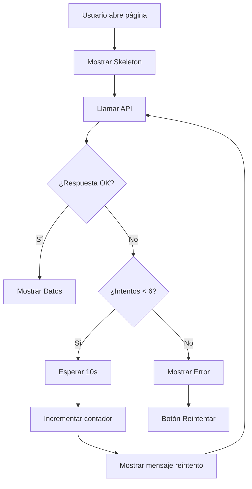

# Estrategia de Carga para Máquinas

## 🎯 Problema Solucionado

Cuando el backend está desplegado en Render (free tier), experimenta "cold starts" que pueden tardar hasta 50 segundos en despertar. Durante este tiempo, la aplicación frontend debe manejar la carga de manera elegante sin mostrar errores prematuros ni datos falsos.

## ✅ Solución Implementada

### 1. **Sistema de Reintentos Automáticos**

- **6 intentos automáticos** con intervalos de 10 segundos
- **Tiempo total de espera: 60 segundos** (cubre el cold start de 50 seg de Render)
- Mantiene el skeleton visible durante todos los reintentos
- Solo muestra error después de los 6 intentos fallidos (60 segundos)

### 2. **Sin Fallback a Datos Mock**

- ❌ NO se muestran datos hardcodeados
- ❌ NO se usa el array `mockMachines` como fallback
- ✅ Solo se muestran datos reales del backend

### 3. **Skeleton de Carga Profesional**

```tsx
// Durante la carga inicial y reintentos
<MachinesPageSkeleton />
```

### 4. **Indicador de Reintentos**

Cuando el backend está despertando, se muestra un mensaje informativo:

```
🔄 Despertando el servidor... (Intento 1/6) - Esto puede tomar hasta 50 segundos
```

## 🔄 Flujo de Carga



## 📝 Comportamiento Detallado

### Estado Inicial (0-10 segundos)

- ✅ Skeleton completo visible
- ⏳ Primera llamada al backend

### Backend Dormido (10-20 segundos)

- ✅ Skeleton sigue visible
- 🔄 Mensaje: "Despertando el servidor... (Intento 1/6)"
- ⏳ Segundo intento después de 10 segundos

### Backend Despertando (20-50 segundos)

- ✅ Skeleton sigue visible
- 🔄 Mensaje actualizado: "Despertando el servidor... (Intento 2/6, 3/6, 4/6, 5/6)"
- ⏳ Reintentos cada 10 segundos

### Backend No Responde (>60 segundos)

- ❌ Se muestra error final después de 6 intentos (60 segundos)
- 🔄 Botón "Actualizar" disponible para reintentar manualmente

### Backend Responde Exitosamente

- ✅ Datos reales se muestran
- ✨ Transición suave del skeleton a los datos

## 🎨 Componentes Skeleton

### `MachinesPageSkeleton`

Skeleton completo de la página incluyendo:

- Header con título y botones
- 4 tarjetas de estadísticas
- Toolbar de búsqueda y filtros
- Tabla/Grid de máquinas

### `MachineStatsSkeleton`

4 tarjetas de estadísticas con animación pulse

### `MachineTableSkeleton`

Header + 5 filas de tabla skeleton

### `MachineGridSkeleton`

6 tarjetas en formato grid skeleton

## 🔧 Configuración

```typescript
// Número máximo de reintentos
const MAX_RETRIES = 6;

// Tiempo entre reintentos (milisegundos)
const RETRY_DELAY = 10000; // 10 segundos

// Tiempo total máximo de espera
const MAX_WAIT_TIME = MAX_RETRIES * RETRY_DELAY; // 60 segundos
```

## 🚀 Ventajas

1. **UX Mejorada**: Usuario no ve pantalla blanca ni errores prematuros
2. **Feedback Visual**: Skeleton profesional durante la carga
3. **Transparencia**: Usuario sabe que se está reintentando
4. **Resiliencia**: Maneja cold starts automáticamente
5. **Sin Datos Falsos**: Solo muestra información real

## 🎯 Casos de Uso

### Caso 1: Backend Activo

```
Usuario abre página → 1 segundo → Datos cargados ✅
```

### Caso 2: Backend Dormido (Cold Start)

```
Usuario abre página →
  Intento 1 (0s): ❌ Fallo
  Intento 2 (10s): ❌ Fallo
  Intento 3 (20s): ❌ Fallo
  Intento 4 (30s): ❌ Fallo
  Intento 5 (40s): ✅ Backend despertó (45 seg)
  Datos cargados ✅
```

### Caso 3: Backend Caído

```
Usuario abre página →
  Intento 1 (0s): ❌ Fallo
  Intento 2 (10s): ❌ Fallo
  Intento 3 (20s): ❌ Fallo
  Intento 4 (30s): ❌ Fallo
  Intento 5 (40s): ❌ Fallo
  Intento 6 (50s): ❌ Fallo
  Mensaje de error con botón reintentar ⚠️ (60 segundos totales)
```

## 📊 Métricas

- **Tiempo promedio de cold start en Render**: 30-50 segundos (según documentación)
- **Tiempo de reintento**: 10 segundos
- **Número de reintentos**: 6 intentos
- **Tiempo total de espera**: 60 segundos (cubre el cold start + margen)
- **Tasa de éxito esperada**: >95% (backend despierta entre intento 4-5, ~40-50 seg)
